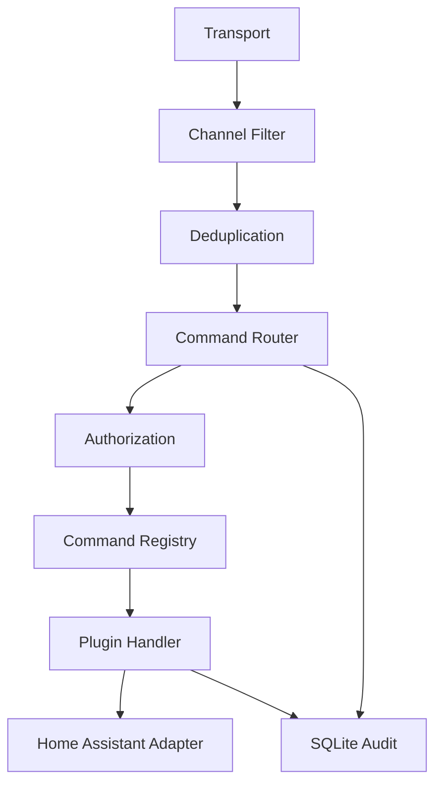

# Architecture

`meshcore-control-bridge` separates transport, routing, authorization, adapters,
and storage so command logic does not depend directly on MeshCore or Home
Assistant.

## Transport Layer

Transports receive `InboundMessage` instances and send `OutboundMessage`
instances. `FakeTransport` is implemented for tests. `MeshCoreTransport` exists
as a placeholder and raises `NotImplementedError` until the real Companion
protocol is confirmed.

When deployed as a Home Assistant App, the same transport uses the Supervisor
proxy and `SUPERVISOR_TOKEN` instead of a user-created Long-Lived Access Token.

## Command Router

The router parses commands with the configured prefix, resolves aliases, checks
authorization, calls the registered handler, and returns a short response.

## Authorization

Authorization maps stable MeshCore sender IDs to roles. Display names are not
trusted. The current roles are `readonly`, `home`, `operator`, and `admin`.

## Plugin Registry

Plugins register commands through `CommandDefinition`, including name, aliases,
usage, help text, minimum role, confirmation flag, and handler.

## Home Assistant Adapter

The Home Assistant client uses the local REST API with configurable base URL,
token, TLS verification, and timeout. The current MVP checks availability.

## Deduplication

The deduplicator records a key in SQLite based on `message_id` when available.
If no ID exists, it uses sender, channel, content hash, and a time bucket.

## SQLite Audit

SQLite stores inbound message metadata, command executions, confirmations,
authorized users, audit events, and deduplication keys. Message text is hashed in
the inbound table.

## Future Server Providers

Future providers may include Proxmox, Docker through a restricted API or socket
proxy, MQTT, Prometheus, or allow-listed local scripts. They must not expose
generic shell access.

## Multiplatform Direction

Home Assistant is a deployment runtime and adapter, not the center of the
system. The target architecture is a room-based model where MeshCore through
Home Assistant, Telegram, CLI, and future transports normalize inbound messages
before they reach the same command router.

See [multiplatform-room-architecture.md](multiplatform-room-architecture.md)
for the proposed message, identity, room, authorization, deduplication, loop
prevention, and PR plan.
