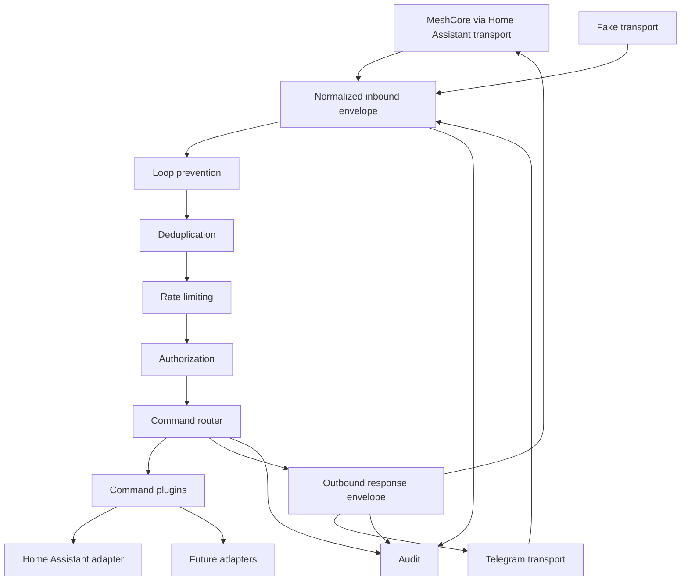

# Multiplatform Room Architecture

This document describes the target architecture for making
`meshcore-control-bridge` a transport-neutral room command system. Home
Assistant remains an important adapter and deployment runtime, but it must not
be the center of the command engine.

The next milestone is limited to Telegram read-only commands:

- Telegram receives messages.
- Telegram sender identity maps to the common identity model.
- `!ping` and `!help` work from Telegram.
- MeshCore through Home Assistant and Telegram use the same `CommandRouter`.
- The core has no dependency on Home Assistant runtime objects.
- No write commands are enabled.

Automatic bridging between platforms is intentionally out of scope until message
IDs, origins, correlation IDs, deduplication, and loop prevention rules are
specified and tested.

## Current State

The current code already has useful separation:

- `InboundMessage` and `OutboundMessage` dataclasses.
- A `Transport` protocol.
- `BridgeService` for channel filtering, deduplication, rate limiting, routing,
  and responding.
- `CommandRouter` independent from MeshCore protocol details.
- `HomeAssistantMeshCoreTransport` translating Home Assistant `meshcore_message`
  events to command messages.
- `HomeAssistantClient` as an adapter used by read-only status commands.

The main limitation is that the common model still uses MeshCore-specific
language:

- `channel_index` assumes numeric MeshCore channels.
- `destination` assumes a sender-oriented reply target.
- `sender_id` is a string without typed identity kind, instance scope, or trust
  level.
- Deduplication keys do not include a room abstraction or direction.
- Audit rows store transport and channel data, but not a normalized room,
  origin, correlation ID, schema version, or transport capability snapshot.
- Home Assistant App runtime code constructs configuration for both the
  Home Assistant MeshCore transport and the Home Assistant REST adapter, which
  can make Home Assistant look like the hub rather than one adapter.

## Target Shape



The command router should only depend on normalized envelopes and service
adapters. A transport may be backed by Home Assistant, Telegram, USB serial, CLI,
or tests, but those details should stop at the transport boundary.

## Common Model

### Schema Version

Normalized envelopes and audit events must carry an explicit schema version so
future bridge rules and migrations can reject unknown shapes instead of
silently misinterpreting them.

Initial value:

```python
NORMALIZED_MESSAGE_SCHEMA_VERSION = 1
AUDIT_EVENT_SCHEMA_VERSION = 1
```

### Transport Name

A stable lowercase identifier for the adapter implementation.

Examples:

- `meshcore-ha`
- `meshcore-usb`
- `telegram`
- `fake`

Transport names are not security identities. They only scope message IDs,
capabilities, room IDs, and audit records.

Avoid duplicating `transport` as a free field in multiple nested objects. The
authoritative transport for an inbound command should be
`InboundEnvelope.source_room.transport`. `SenderIdentity.transport_scope` exists
only to prevent collisions between identity providers and must match the source
transport unless a documented transport explicitly delegates identity to another
provider.

### Rooms and Reply Targets

A source room is the transport-neutral place where a message was observed. A
reply target is where the command response should be sent. They are often the
same, but they should be separate fields because direct messages, threads,
future bridged rooms, and platform-specific reply APIs may differ.

Proposed model:

```python
@dataclass(frozen=True, slots=True)
class RoomRef:
    transport: str
    room_id: str
    room_kind: Literal["meshcore_channel", "telegram_chat", "direct", "local"]
    display_name: str | None = None
    metadata: Mapping[str, object] = field(default_factory=dict)
```

Examples:

- MeshCore channel 1 through Home Assistant:
  `RoomRef("meshcore-ha", "meshcore-ha:channel:1", "meshcore_channel")`
- Telegram chat:
  `RoomRef("telegram", "telegram:chat:-1001234567890", "telegram_chat")`
- Future CLI:
  `RoomRef("local-cli", "local-cli:session", "local")`

MeshCore channel `0` remains forbidden for administration by policy. That policy
should live in room authorization or transport configuration, not in command
handlers.

Future linked rooms are a separate concept. A linked-room rule may map a source
room to one or more destinations for bridging, but command replies should not
use linked rooms unless bridging has been explicitly enabled and loop prevention
has been implemented.

### Sender Identity

Sender identity should be typed and should record whether it is stable enough
for authorization.

Proposed model:

```python
@dataclass(frozen=True, slots=True)
class SenderIdentity:
    sender_id: str
    transport_scope: str
    identity_kind: Literal[
        "meshcore_pubkey_prefix",
        "meshcore_node_id",
        "telegram_user_id",
        "telegram_sender_chat_id",
        "synthetic_test",
        "unknown",
    ]
    stable: bool
    display_name: str | None = None
    metadata: Mapping[str, object] = field(default_factory=dict)
```

Rules:

- Authorization must use `sender_id`, not display names.
- Display names are for diagnostics only.
- Synthetic identities are allowed only when an explicit test mode grants a
  temporary read-only role.
- Telegram should use numeric Telegram user IDs for user identity, not usernames.
- Telegram chats belong to `RoomRef`, not normal sender identity.
- If Telegram channel posts or anonymous group administrators are supported
  later, they must use a distinct `telegram_sender_chat_id` identity kind and a
  separate authorization policy.
- Telegram usernames and chat titles are not authentication material.
- Sender IDs must include an instance namespace so the same external ID from two
  different bots, Companion instances, or test transports cannot collide.

Examples:

- `meshcore-pubkey-prefix:home:abcdef123456`
- `telegram-user:primary-bot:123456789`
- `test:unidentified:meshcore-ha:channel:1`

The instance segment should be configured, stable, and non-secret. Examples are
`home`, `primary-bot`, or `lab`. Do not use a token, private key, or personal
device name as the instance value.

### Message Identity

Inbound message IDs must be scoped by transport and room. A platform-provided
message ID is preferred. If no stable ID exists, use a hash fallback with a
short replay window.

Proposed model:

```python
@dataclass(frozen=True, slots=True)
class MessageIdentity:
    message_id: str | None
    id_kind: Literal["platform", "derived", "missing"]
    correlation_id: str
    origin: MessageOrigin
```

`correlation_id` links an inbound command, command execution, and outbound
response. It is not used as authentication.

### Origin

Origin is required before any cross-platform bridging exists.

Proposed model:

```python
@dataclass(frozen=True, slots=True)
class MessageOrigin:
    transport: str
    room_id: str
    message_id: str | None
    bridge_instance_id: str | None = None
```

Loop prevention should mark messages generated by this bridge and ignore them
when they return through a transport as events.

### Inbound Envelope

Proposed future replacement for the current `InboundMessage` shape:

```python
@dataclass(frozen=True, slots=True)
class InboundEnvelope:
    schema_version: int
    source_room: RoomRef
    reply_target: RoomRef
    sender: SenderIdentity
    message: MessageIdentity
    text: str
    received_at: datetime
    metadata: Mapping[str, object] = field(default_factory=dict)
```

Compatibility can be introduced gradually by adding fields to the existing
`InboundMessage` first, then migrating storage and tests.

Validation rules:

- `schema_version` must be supported by the running bridge.
- `source_room.transport` is the authoritative transport name.
- `reply_target.transport` must match `source_room.transport` until
  cross-platform bridging is designed and enabled.
- `sender.transport_scope` must match the source transport or a documented
  delegated identity provider.

### Outbound Response

Outbound responses should target a room, not a MeshCore channel.

```python
@dataclass(frozen=True, slots=True)
class OutboundResponse:
    schema_version: int
    reply_target: RoomRef
    text: str
    reply_to: str | None
    correlation_id: str
    metadata: Mapping[str, object] = field(default_factory=dict)
```

The transport decides how to convert that response:

- MeshCore through Home Assistant calls `meshcore.send_channel_message`.
- Telegram calls `sendMessage`.
- FakeTransport appends to an in-memory queue.

## Transport Capabilities

Each transport should expose capabilities so the core does not assume every
platform behaves like LoRa.

```python
@dataclass(frozen=True, slots=True)
class TransportCapabilities:
    supports_replies: bool
    supports_message_ids: bool
    supports_stable_sender_ids: bool
    supports_room_ids: bool
    supports_direct_messages: bool
    max_outbound_chars: int
    delivery: Literal["best_effort", "acknowledged", "unknown"]
```

Initial capabilities:

| Transport | Stable sender | Message ID | Room ID | Max response | Delivery |
| --- | --- | --- | --- | --- | --- |
| MeshCore via Home Assistant | yes when `pubkey_prefix` is present | Home Assistant context ID or derived | channel index | LoRa-short | best effort |
| Telegram | numeric user ID | Telegram message ID | chat ID | larger than LoRa | acknowledged by API |
| Fake | configurable | configurable | configurable | test-defined | unknown |

Handlers should not directly inspect capabilities. The response formatter may
use them to trim or paginate output.

## Authorization

Authorization should become transport-neutral:

```yaml
users:
  "meshcore-pubkey-prefix:home:abcdef123456":
    name: admin-device
    role: admin

  "telegram-user:primary-bot:123456789":
    name: admin-telegram
    role: readonly
```

Room policy should be separate from user identity:

```yaml
rooms:
  "meshcore-ha:channel:1":
    enabled: true
    minimum_role: readonly
    allow_commands: true

  "telegram:chat:123456789":
    enabled: true
    minimum_role: readonly
    allow_commands: true
```

The effective permission is the stricter result of:

- sender role;
- room policy;
- command minimum role;
- optional transport capability restrictions;
- optional test-mode restrictions.

Unidentified testing must remain an explicit read-only mode and should produce a
synthetic sender only for the configured room.

## Command Context

`CommandContext` should be transport-neutral and should not expose Home
Assistant runtime details.

Proposed model:

```python
@dataclass(slots=True)
class CommandContext:
    inbound: InboundEnvelope
    user: AuthorizedUser
    services: ServiceRegistry
    response_profile: ResponseProfile
```

`ResponseProfile` can describe formatting constraints:

- `short_text`
- `max_chars`
- `line_budget`
- `supports_markdown`

MeshCore responses stay brief. Telegram can use a larger profile, but commands
should still return concise text by default.

## Deduplication

Deduplication should use a normalized key:

```text
source_room.transport | source_room.room_id | sender_ref_hash | message_id
```

When the platform lacks `message_id`, fallback to:

```text
source_room.transport | source_room.room_id | sender_ref_hash | time_bucket | hash(normalized_text)
```

Do not deduplicate across transports unless a future bridge explicitly sets a
shared `correlation_id`. A Telegram `!ping` and MeshCore `!ping` are different
commands.

## Loop Prevention

Loop prevention is required before automatic bridging.

Current command replies are not bridging. They should still carry metadata that
prevents self-processing if a transport emits outgoing messages as inbound
events.

Initial rules:

- Ignore transport events marked as outgoing.
- Attach a bridge-generated `correlation_id` to audit records.
- Store outbound responses with `origin.transport`, `source_room.room_id`,
  `reply_target.room_id`, and `reply_to`.
- Do not forward messages from one transport to another in the Telegram
  milestone.

Future bridge rules must define:

- which rooms are linked;
- which command prefixes are bridged or suppressed;
- how TTL is represented;
- how edits/deletes are handled;
- how loops are detected across restarts;
- whether bridged messages are auditable without storing private text.

## Audit Events

Audit should record normalized metadata without storing full private message
text or stable sender IDs.

Stable sender IDs should live only in protected authorization configuration and
in process memory. Audit storage should record a keyed hash or HMAC reference so
events can be correlated without exposing identifiers if the SQLite database is
published accidentally.

Suggested reference:

```text
sender_ref_hash = HMAC-SHA256(audit_key, sender_id)
```

`audit_key` must be generated or configured outside the repository and rotated
with an operator-visible migration plan. If no audit key is configured yet, use
a clearly documented local-only fallback and mark the audit as not stable across
rotations.

Suggested event fields:

- `audit_id`
- `schema_version`
- `correlation_id`
- `event_type`
- `source_transport`
- `source_room_id`
- `source_room_kind`
- `reply_transport`
- `reply_room_id`
- `sender_ref_hash`
- `sender_identity_kind`
- `sender_stable`
- `message_id`
- `command`
- `result`
- `reason`
- `duration_ms`
- `created_at`
- `metadata_json`

Private message text should remain hashed, not stored verbatim.

## Metadata Rules

Transport metadata is useful for diagnostics, but it must remain constrained.

Rules:

- Metadata must be JSON-serializable.
- Metadata size must be bounded per event and per audit row.
- Metadata must not contain tokens, Authorization headers, channel secrets,
  private keys, raw packet captures, or full private message text.
- Metadata must not duplicate `text`; store hashes or short classifications
  instead.
- Each transport must document its metadata keys and whether they are stable,
  sensitive, or diagnostic only.
- Unknown metadata keys from external APIs should be dropped by default unless a
  transport explicitly allowlists them.

Initial MeshCore through Home Assistant metadata keys:

- `ha_event_type`
- `ha_context_id`
- `message_type`
- `pubkey_prefix_available`
- `stable_sender`
- `hop_count`
- `snr`
- `rx_log_count`

Initial Telegram metadata keys:

- `update_id`
- `message_id`
- `chat_type`
- `has_thread_id`

Telegram `text`, usernames, chat titles, and bot tokens must not be copied into
metadata.

## Home Assistant's Role

Home Assistant should have two separate responsibilities:

1. Runtime for the Home Assistant App deployment.
2. Adapter for Home Assistant state queries and MeshCore events from
   `meshcore-ha`.

Neither responsibility should leak into the command core.

The Home Assistant App may construct a config object from `/data/options.json`
and `SUPERVISOR_TOKEN`, but after startup it should provide the same transport
and adapter interfaces as any other deployment.

## Telegram Milestone Design

The Telegram adapter should be added as another transport, not as a special
router path.

Initial scope:

- Long polling or webhook decision documented before implementation.
- Receive text messages.
- Map Telegram user ID to `telegram-user:<bot-instance>:<id>`.
- Map Telegram chat ID to `telegram:chat:<id>`.
- Use the existing command prefix.
- Support only `!ping` and `!help` initially.
- Reuse the same `CommandRouter`.
- Use the same `Authorizer`, `Deduplicator`, `RateLimiter`, and audit storage.
- Do not bridge Telegram messages to MeshCore.
- Do not enable Home Assistant writes.

Security rules:

- Do not authorize by Telegram username.
- Do not log full message text by default.
- Store Telegram bot token only in environment or external secrets.
- Ignore non-text messages for the first milestone.
- Treat group chats and private chats as different rooms.
- Treat `sender_chat` as unsupported until a separate
  `telegram_sender_chat_id` policy exists.

## PR Plan

### PR 1: Normalize Core Message Model

Goal: introduce transport-neutral types while preserving existing behavior.

Changes:

- Add `RoomRef`, `SenderIdentity`, `MessageIdentity`, `MessageOrigin`,
  `InboundEnvelope`, `OutboundResponse`, and `TransportCapabilities`.
- Add compatibility constructors from current `InboundMessage`.
- Keep the existing router behavior unchanged.
- Add tests for MeshCore through Home Assistant and FakeTransport compatibility.

Acceptance criteria:

- Existing MeshCore through Home Assistant App tests still pass.
- `!ping`, `!help`, `!estado ha`, and `!estado` behave the same as before.
- The normalized model carries `schema_version`.
- `source_room`, `reply_target`, and `sender` validate transport and instance
  scope consistency.
- No Home Assistant runtime imports are added to command router modules.

Risk: low if the existing dataclasses remain available during migration.

### PR 2: Move Filtering and Authorization to Normalized Context

Goal: remove MeshCore-specific channel assumptions from core services.

Changes:

- Replace `channel_index` checks in `BridgeService` with room policy checks.
- Keep `channel_index` as MeshCore metadata only.
- Add room allowlist configuration.
- Update deduplication to include `room_id`.
- Update audit records with room and correlation fields.

Acceptance criteria:

- MeshCore channel `0` remains rejected for administration.
- A message from a non-configured room is ignored before command execution.
- Deduplication keys include `source_room.room_id`.
- Audit stores `sender_ref_hash` rather than the raw stable sender ID.
- The existing unidentified readonly testing behavior still works only for the
  configured room.

Risk: medium because it touches command ingress and audit.

### PR 3: Transport Capabilities and Response Profiles

Goal: make output formatting transport-aware without changing command handlers.

Changes:

- Add `TransportCapabilities`.
- Add `ResponseProfile`.
- Keep LoRa-short formatting for MeshCore.
- Allow Telegram to use a larger default response size later.

Acceptance criteria:

- MeshCore responses keep the current LoRa-oriented length limit.
- FakeTransport tests can set custom capabilities.
- Command handlers do not branch on transport names.
- Response formatting uses `ResponseProfile`, not direct MeshCore checks.

Risk: low.

### PR 4: Telegram Transport Skeleton

Goal: add Telegram as a transport behind the same interface.

Changes:

- Add Telegram config with token from environment only.
- Implement receive/send using one selected mode, preferably long polling for
  the first local milestone unless webhook deployment is explicitly chosen.
- Map Telegram user and chat IDs to common identity and room models.
- Add tests with mocked Telegram API.
- No bridging and no write commands.

Acceptance criteria:

- Telegram user identity is `telegram-user:<bot-instance>:<user-id>`.
- Telegram chat identity is represented only as `RoomRef`.
- Telegram `sender_chat` messages are ignored or marked unsupported unless a
  dedicated `telegram_sender_chat_id` policy is added.
- Bot token is loaded from environment or external secrets only.
- Mocked tests cover long polling, send response, duplicate update handling,
  and token redaction.

Risk: medium due to API polling, token handling, and offset persistence.

### PR 5: Telegram Read-Only Commands

Goal: make `!ping` and `!help` work from Telegram using the same router.

Changes:

- Wire Telegram transport into app startup for non-Home Assistant deployments.
- Add config examples for Telegram users and rooms.
- Add audit tests for Telegram command execution.
- Verify no Home Assistant runtime dependency in core.

Acceptance criteria:

- `!ping` returns `pong` from Telegram.
- `!help` is generated from the same command registry used by MeshCore.
- Unauthorized Telegram users receive the configured denial response.
- Telegram and MeshCore commands share `CommandRouter`, `Authorizer`,
  `Deduplicator`, `RateLimiter`, and audit storage.
- No Home Assistant token or Supervisor runtime is required for Telegram-only
  command routing tests.

Risk: low to medium.

### PR 6: Bridging Design Only

Goal: document cross-platform message bridging before implementation.

Changes:

- Specify bridge rules, room mappings, TTL, loop prevention, correlation IDs,
  and audit semantics.
- Add tests for rule evaluation without sending real messages.
- Do not forward messages yet.

Acceptance criteria:

- The document defines source rooms, reply targets, linked rooms, TTL,
  correlation IDs, and loop prevention state.
- Rule evaluation tests do not send messages through real transports.
- No production code forwards Telegram messages to MeshCore or MeshCore messages
  to Telegram.
- Audit design covers bridged events without storing private text.

Risk: low.

## Non-Goals for This Milestone

- MeshCore USB changes.
- Home Assistant entity expansion.
- Lights, scenes, locks, alarms, or server actions.
- Telegram-to-MeshCore or MeshCore-to-Telegram automatic forwarding.
- Critical commands or confirmation flows.
- Publishing a new Home Assistant App version.
