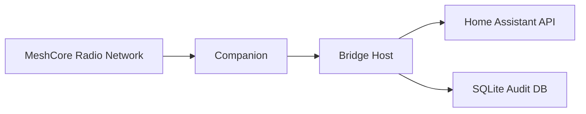

# Security Model

This project is experimental and has not been formally audited.

## Protected Assets

- Home Assistant access token.
- MeshCore channel secrets and private keys.
- Stable MeshCore sender identifiers.
- Local Home Assistant API.
- Local network and monitoring APIs.
- Audit database.
- Host running the bridge.

## Actors

- Authorized MeshCore sender.
- Unauthorized MeshCore participant.
- Passive LoRa observer.
- Compromised MeshCore Companion.
- Compromised bridge host.
- Contributor or operator who accidentally publishes secrets.

## Trust Boundaries

The private MeshCore channel is treated as a confidentiality boundary, not an
authentication boundary. Authentication depends on stable sender IDs configured
locally.

## Threats

- Replay attacks.
- LoRa packet duplication.
- Sender spoofing or unstable sender identity.
- Loss of channel secret.
- Abuse of non-idempotent actions.
- Log or database leakage.
- Companion compromise.
- Local host compromise.
- Accidental publication of tokens or packet captures.

## Current Mitigations

- Reject channel `0` for administration.
- Route only the configured private channel.
- Require configured sender IDs.
- Use registered commands only.
- No shell, arbitrary SSH, `eval`, or `shell=True`.
- Deduplicate messages by ID or time-window hash.
- Store inbound message text as hashes in audit storage.
- Keep secrets out of examples.
- Provide a local secret-check script and CI step.

## Pending Mitigations

- Real MeshCore transport validation.
- Confirmation flow for sensitive actions.
- Rate limiting.
- Better audit retention cleanup.
- Signed or authenticated payloads if supported by MeshCore.
- Formal security review.
- Fuzzing for command parsing and transport decoding.

## Replay and Duplicate Commands

Mesh networks can repeat packets. Deduplication is required before command
execution. Non-idempotent future actions must be recorded before execution and
must require confirmation.

## Sender Spoofing

Visible node names are not trusted. Operators should use stable public keys or
stable node identifiers, and should rotate configuration if a device is lost.

## Loss of Channel Secret

If a private channel secret is leaked, assume confidentiality is lost. Rotate the
channel secret and review authorized sender IDs.

## Logs and Databases

Do not publish logs, `.env`, `config.yaml`, SQLite files, or packet captures
without careful redaction.

## Companion or Host Compromise

A compromised Companion or host may bypass the assumptions of this project.
Keep the bridge host patched, restrict filesystem permissions, and run the
daemon as a dedicated user.
